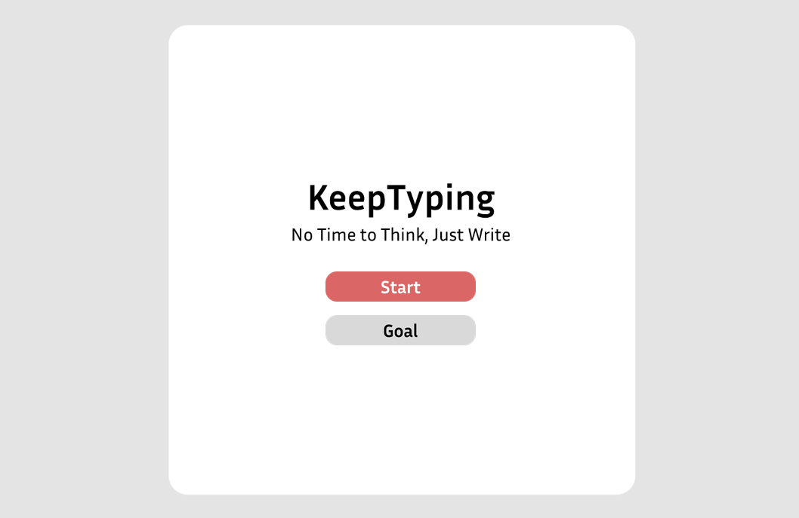
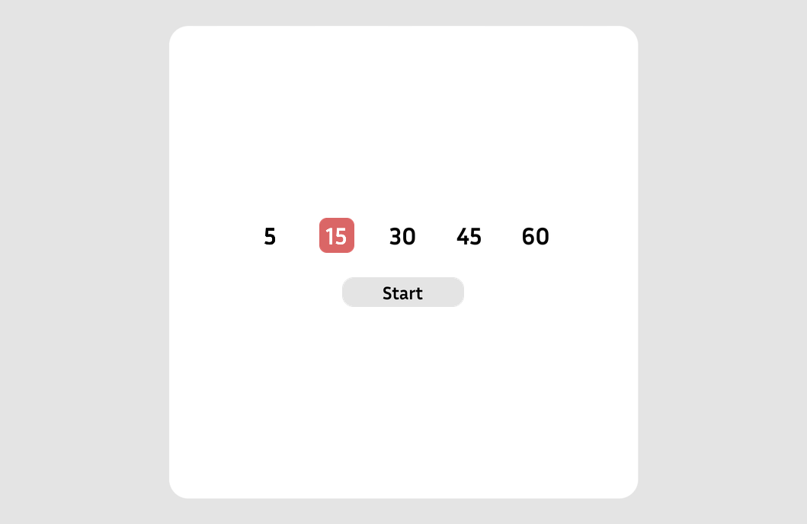
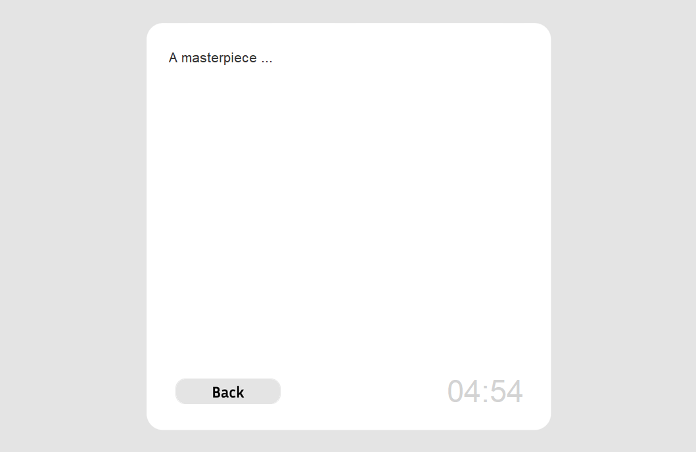
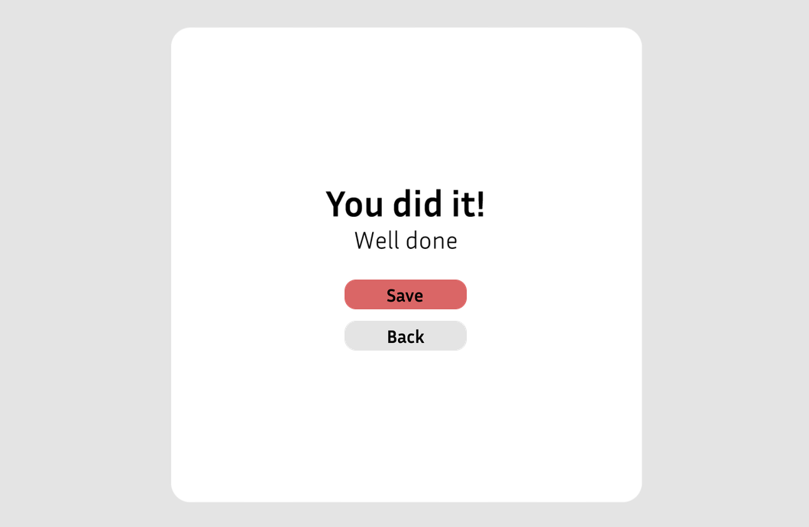

# KeepWriting

A desktop GUI app built with Python and Tkinter.
Erases your entire draft after a five-second pause, forcing you to keep typing and break through writer’s block.

<p align="center">
  
</p>
<p align="center">
  
  
</p>
<p align="center">
  
  
</p>

## Features

- Choose writing goals (5, 15, 30, 45, or 60 minutes)
- Real-time typing area with a timer
- Visual feedback on typing activity
- Save your written text to a file after finishing

## Installation

1. Make sure you have Python 3 installed.
2. Clone this repository:
```bash
git clone https://github.com/Hesoom/Keep-Writing
```

## Usage
Run the main file:
```bash
python main.py
```

Select a goal and start typing!

## Notes

- Uses Tkinter and Tkinter Designer for the GUI.
- Includes basic file saving functionality.
- Designed for simplicity and focus on typing practice.
